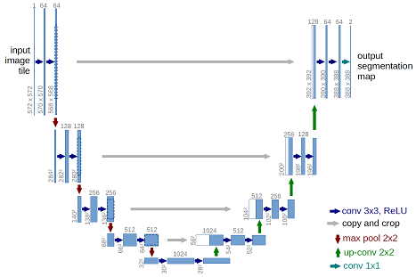
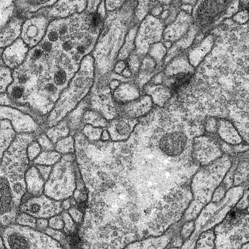
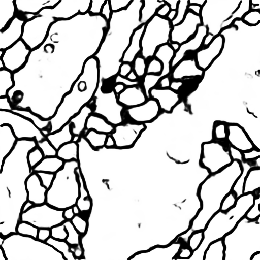

# U-Net Image Segmentation Implementation

A Keras implementation of the U-Net architecture for image segmentation tasks, originally designed for biomedical image segmentation and extended to person segmentation.

## Overview

### Original Project

This project implements the U-Net architecture proposed in [U-Net: Convolutional Networks for Biomedical Image Segmentation](http://lmb.informatik.uni-freiburg.de/people/ronneber/u-net/).

The original dataset is from the [ISBI challenge](http://brainiac2.mit.edu/isbi_challenge/), with pre-processed data available in `data/membrane`.

### Extensions

The project has been extended to support:
- **Person segmentation** on real-world images
- **RGB image input** (original was grayscale)
- **Multiple datasets**: ISBI membrane, synthetic stick figures, Pascal VOC person dataset

---

## Architecture



U-Net features an encoder-decoder structure with skip connections:
- **Encoder**: Downsamples input to extract features
- **Decoder**: Upsamples to reconstruct spatial resolution
- **Skip connections**: Preserve fine details from encoder layers

Output is a segmentation mask with pixel values in [0, 1] range (sigmoid activation).

---

## Data

### ISBI Membrane Dataset (Original)
- **Location**: `data/membrane/`
- **Images**: 30 training images (512×512 grayscale)
- **Task**: Cell membrane segmentation

### Person Segmentation Datasets
- **Synthetic Stick Figures**: `dataset/train/` (10 images)
- **Pascal VOC Person**: `pascal_voc_person/` (888 images, 50 used for training)

### Data Augmentation

To address limited training data, we use `ImageDataGenerator` from `keras.preprocessing.image`:

```python
data_gen_args = dict(
    rotation_range=0.2,
    width_shift_range=0.1,
    height_shift_range=0.1,
    shear_range=0.05,
    zoom_range=0.1,
    horizontal_flip=True,
    fill_mode='nearest'
)
```

---

## Model

The U-Net model is implemented using Keras functional API:

```python
from model import unet

model = unet()
model.summary()
```

**Key Features**:
- 5-level encoder-decoder
- Skip connections at each level
- Sigmoid activation for binary segmentation
- Adam optimizer with learning rate 1e-4

---

## Training

### ISBI Membrane Segmentation

```bash
python main.py
```

- **Epochs**: 5
- **Accuracy**: ~0.97
- **Loss**: Binary crossentropy
- **Output**: `unet_membrane.hdf5`

### Person Segmentation

#### Option 1: Synthetic Data
```bash
cd person_segmentation
python download_sample_data.py  # Generate synthetic stick figures
python train_person.py
```

#### Option 2: Real Data (Pascal VOC)
```bash
cd person_segmentation
python download_pascal_voc.py  # Download Pascal VOC person dataset
python train_pascal.py
```

**Training Parameters**:
- **Batch size**: 2-4 (adjust based on available memory)
- **Epochs**: 5-10
- **Optimizer**: Adam
- **Loss**: Binary crossentropy

---

## Prediction

### ISBI Membrane

```bash
python predict.py
```

Results saved in `data/membrane/test/`.

### Person Segmentation

```bash
cd person_segmentation
python predict_person.py  # For synthetic-trained model
# or
python predict_pascal.py   # For Pascal VOC-trained model
```

Place your test images in `dataset/test/`. Results will be saved with `_predict.png` or `_pascal.png` suffix.

---

## Results

### ISBI Membrane Segmentation




### Person Segmentation

| Method | Training Data | Performance |
|--------|--------------|-------------|
| Original U-Net | 10 synthetic figures | Basic contours |
| Pascal VOC U-Net | 50 real person images | Clear boundaries, better generalization |

---

## Dependencies

### Required Libraries

- Python 3.7+
- TensorFlow >= 2.0
- Keras >= 2.0 (included in TensorFlow)
- NumPy
- Pillow (PIL)
- scikit-image
- Matplotlib

### Installation

```bash
pip install tensorflow numpy pillow scikit-image matplotlib
```

---

## Project Structure

```
unet-master/
├── data/
│   └── membrane/           # ISBI dataset
├── person_segmentation/    # Person segmentation extension
│   ├── dataset/
│   │   ├── train/         # Synthetic training data
│   │   └── test/          # Test images
│   ├── pascal_voc_person/ # Pascal VOC person dataset
│   ├── model_rgb.py       # RGB U-Net model
│   ├── data_rgb.py        # RGB data generators
│   ├── train_person.py    # Training script (synthetic)
│   ├── train_pascal.py    # Training script (Pascal VOC)
│   ├── predict_person.py  # Prediction script (synthetic)
│   └── predict_pascal.py  # Prediction script (Pascal VOC)
├── model.py               # Original U-Net model
├── data.py                # Original data generators
├── main.py                # Original training script
├── predict.py             # Original prediction script
└── README.md
```

---

## Notes

### Version Compatibility

This code has been updated to work with modern Keras/TensorFlow (Keras 3.x). Key changes from original:
- Model checkpoint format: `.hdf5` → `.keras`
- `fit_generator()` → `fit()`
- `learning_rate` parameter (was `lr`)
- Model creation: `Model(inputs=..., outputs=...)`

### Memory Considerations

Training with large datasets may require:
- Reducing batch size (try 2 or 4)
- Limiting training images (e.g., first 50-100 images)
- Using GPU if available

---

## About Keras

Keras is a minimalist, highly modular neural networks library, written in Python and capable of running on top of TensorFlow. It was developed with a focus on enabling fast experimentation.

Use Keras if you need a deep learning library that:
- Allows for easy and fast prototyping
- Supports both convolutional and recurrent networks
- Supports arbitrary connectivity schemes
- Runs seamlessly on CPU and GPU

Read the documentation at [Keras.io](https://keras.io)

---

## License

This project is based on the original U-Net implementation. Please refer to the original paper for license information.

## References

- Ronneberger, O., Fischer, P., & Brox, T. (2015). U-Net: Convolutional Networks for Biomedical Image Segmentation. [arXiv:1505.04597](https://arxiv.org/abs/1505.04597)
- ISBI Challenge: [http://brainiac2.mit.edu/isbi_challenge/](http://brainiac2.mit.edu/isbi_challenge/)
- Pascal VOC Dataset: [http://host.robots.ox.ac.uk/pascal/VOC/voc2012/](http://host.robots.ox.ac.uk/pascal/VOC/voc2012/)
